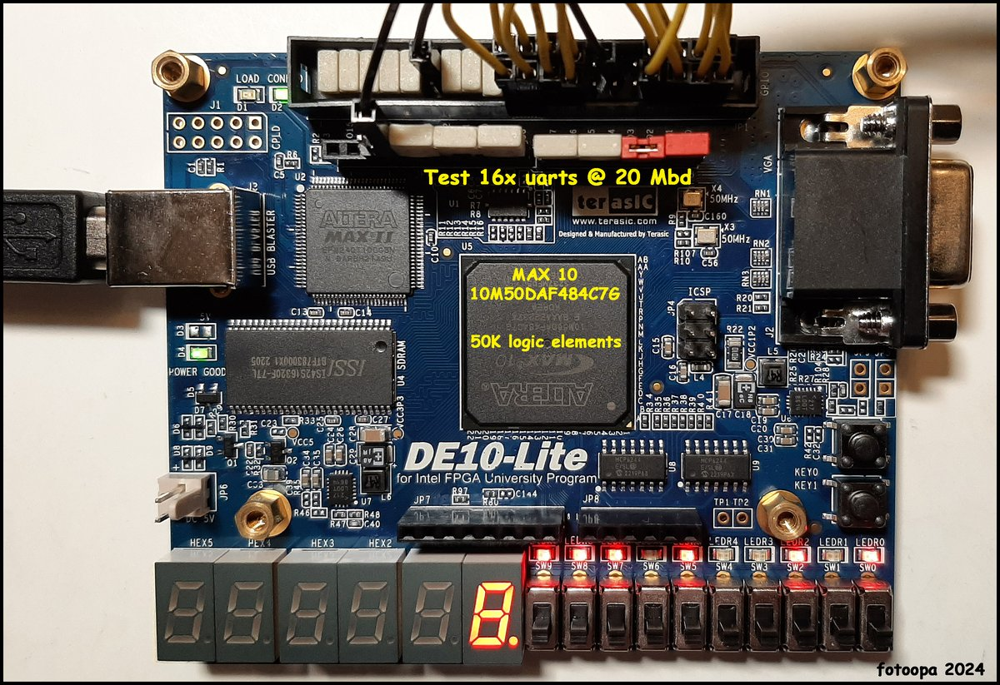

# FPGA Snake Game (Verilog HDL)


-0071C5?logo=intel&logoColor=white)


A snake game on the Terasic DE10-Lite, written entirely in Verilog HDL.



<sub>Target board: Terasic DE10-Lite. Representative photo, not this project's setup (the yellow labels are the photographer's). Photo: [“DE10-Lite-20240112_160112”](https://www.flickr.com/photos/fotoopa_hs/53459607598) by Frans ([fotoopa](https://www.flickr.com/photos/fotoopa_hs)), licensed under [CC BY 2.0](https://creativecommons.org/licenses/by/2.0/); resized.</sub>

## Project Overview

This project is a hardware-level implementation of the classic **Snake Game** for the **Terasic DE10-Lite (MAX 10 FPGA)** platform. It is a pure RTL design in **Verilog HDL**: there is no soft processor (such as Nios II) and no software. Game control, snake storage, collision detection, pseudo-random food placement and display scanning are all implemented in logic.

The design covers the usual building blocks of a small digital system: a control FSM, a circular-buffer datapath, counter-based clock division, keypad scanning, a multiplexed LED-matrix driver and seven-segment decoding.

This project is intended for:

* Developers interested in Verilog HDL and FPGA development.
* Students studying digital logic design, FSMs, clock division and display multiplexing.

---

## Gameplay Features

### Dynamic Difficulty

* **Speed Leveling**: The snake makes one move per tick of the game clock, whose rate is set by the score. It rises in steps from 1.11 Hz at score 0 to 10 Hz from score 8 (see [Game Speed](#game-speed)).
* **Speed Indicator**: Exactly one of `LEDR[0]`–`LEDR[4]` is lit, showing `score / 2` capped at 4.

### Scoring and Game Over

* **Score**: One point per food item, up to 99, shown on HEX5–HEX4.
* **Play Time**: Minutes and seconds (MMSS) on HEX3–HEX0. The timer runs only in the Play state.
* **Game Over**: Triggered if the snake hits the edge of the 16x8 grid or its own body. Every dot on the matrix lights up and the game stays there until reset.

### Core Mechanics

* **Pointer-based Movement**: The body is a 32-entry circular buffer, so each move is an O(1) update. The snake starts 3 segments long and grows by one per food item, up to the 32 segments the buffer holds.
* **Pseudo-random Spawning**: Food positions are generated using a 16-bit hardware LFSR.
* **No Reversing**: A key for the direction opposite to the current one is ignored.
* **FSM-controlled Logic**: Dedicated states for Idle, Play, Pause and Dead (game over).

---

## Controls

### Matrix Keypad (4x4)

Only four keys are decoded. They form a plus sign around the key at keypad row 1, column 1. The keypad is scanned one row at a time (active-low), and the last direction key pressed stays latched.

| Keypad key (row line × column line) | Snake moves toward | Name in `Game_Engine` |
| --- | --- | --- |
| `keypad_row[0]` × `keypad_col[1]` | `matrix_row_sel[0]` side | `KEY_DOWN` |
| `keypad_row[2]` × `keypad_col[1]` | `matrix_row_sel[7]` side | `KEY_UP` |
| `keypad_row[1]` × `keypad_col[0]` | `matrix_col_data[0]` side | `KEY_RIGHT` |
| `keypad_row[1]` × `keypad_col[2]` | `matrix_col_data[15]` side | `KEY_LEFT` |

Each key moves the snake toward the matching side of the matrix: a lower keypad row or column index moves it toward a lower matrix row or column index. Which way that is on screen depends on how the keypad and the matrix are wired and mounted, which the RTL does not fix. For example, with a standard `1 2 3 A` / `4 5 6 B` / `7 8 9 C` / `* 0 # D` keypad whose row 0 is the top row and column 0 the left column, and a matrix whose row 0 and column 0 are at its top-left corner, the keys are **2** up, **8** down, **4** left and **6** right.

The `KEY_*` names refer to the game's internal (x, y) grid. The frame generator draws cell (x, y) at matrix row 7 − y, column 15 − x, so both axes are mirrored between the grid and the matrix row/column indices. The snake starts at matrix row 7, columns 13–15, heading toward column 0.

### Onboard Switches (SW)

| Function | Switch |
| --- | --- |
| Reset Game (held while `1`) | SW[0] |
| Pause Game (while `1`) | SW[1] |

After programming, set SW[0] to `1` and back to `0` to initialize the game. It then waits in Idle until a direction key is pressed. Pausing stops both movement and the timer. SW[9:2] and KEY[1:0] have pin assignments but are not used by the logic.

---

## System Architecture

### Hardware Logic Design

* **Clock Divider**: Divides the 50 MHz board clock with counters into three clocks: a 1 kHz scan clock for the keypad and the matrix, a game clock from 1.11 Hz to 10 Hz, and a 1 Hz clock for the timer.
* **Keypad Scanner**: Drives one keypad row low per scan-clock cycle (a full 4-row scan at 250 Hz), decodes the four direction keys and latches the last one.
* **LFSR (Linear Feedback Shift Register)**: 16 bits, seed `0xACE1`, feedback from bits 15, 13, 12 and 10, stepped once per food item eaten. Its low bits give the next food cell. If that cell is already lit, the food is offset by (+3, +1) in grid coordinates.

### Display Drivers

* **16x8 Dot Matrix**: `Game_Engine` builds a 128-bit frame (snake and food, or every dot lit on game over). `Dot_Matrix_Driver` scans it one row per scan-clock cycle, with a one-hot active-low `matrix_row_sel` and 16 `matrix_col_data` bits per row (`1` = dot on). The whole matrix refreshes at 125 Hz.
* **Seven-Segment Controller**: Splits the binary score into two decimal digits (÷10 and mod 10) and decodes them, together with the BCD time digits, into active-low segment patterns.

---

## Core Engine Design

### Efficient Snake Management

* **Circular Buffer**: The body is stored in two 32-entry arrays (`snake_x`, `snake_y`) addressed by 5-bit `head_ptr` and `tail_ptr` pointers. A move writes the new head into the slot after `head_ptr` and advances `tail_ptr`. When food is eaten, `tail_ptr` stays in place and the snake grows by one. The buffer holds 32 segments.
* **Complexity**: Each move updates a fixed number of entries, O(1) per move, instead of shifting every segment (O(N)). Drawing is separate: the frame generator checks all 32 slots combinationally to build the 16x8 frame.

### Collision Detection

* **Boundary Check**: Game over if the head is on an edge of the 16x8 grid and the current direction points off it. There is no wrap-around.
* **Self-collision**: Checks if the new head position is already lit in the frame. The current tail cell and the food cell are not counted.

### Game Speed

`Clock_Divider` toggles the game clock every N cycles of the 50 MHz clock, so one move takes 2N cycles. N starts at 22,500,000 and drops by 5,000,000 per speed level, down to a floor of 2,500,000. The speed level is `score / 2` connected to a 4-bit port.

| Score | Speed level | N (cycles) | Move rate |
| --- | --- | --- | --- |
| 0–1 | 0 | 22,500,000 | 1.11 Hz |
| 2–3 | 1 | 17,500,000 | 1.43 Hz |
| 4–5 | 2 | 12,500,000 | 2.00 Hz |
| 6–7 | 3 | 7,500,000 | 3.33 Hz |
| 8–31 | 4–15 | 2,500,000 (floor) | 10.00 Hz |

Because the speed level is 4 bits wide (`score / 2` modulo 16), the sequence repeats every 32 points: score 32 plays at 1.11 Hz again. The LED indicator is computed separately from the full score and stays on `LEDR[4]` from score 8 upward.

---

## Code Structure

```
FPGA-Game-Engine/
├── Snake_Game_Top.v      // All RTL, one module per concern (see below)
├── Snake_Game_Top.qpf    // Quartus project
├── Snake_Game_Top.qsf    // Device, source and pin assignments
├── de10_lite_pins.tcl    // DE10-Lite pin map as a standalone, commented script
├── docs/images/          // Board photo used in this README
└── LICENSE
```

Modules in `Snake_Game_Top.v`:

| Module | Role |
| --- | --- |
| `Snake_Game_Top` | Top level: board I/O, module wiring, speed-level LED |
| `Clock_Divider` | 1 kHz scan clock, 1 Hz timer clock and score-dependent game clock |
| `Keypad_Scanner` | 4x4 keypad row scan; decodes and latches the four direction keys |
| `Game_Engine` | FSM, circular-buffer snake, collision, LFSR food placement, play timer, 16x8 frame generation |
| `Dot_Matrix_Driver` | Row-scans the 128-bit frame onto the 16x8 matrix |
| `Seven_Seg_Controller` | Score to decimal digits; seven-segment decoding of score and time |

---

## Build

Target device: **MAX 10 `10M50DAF484C7G`** (DE10-Lite), built with **Quartus Prime 18.1 Lite Edition**.

1. Open `Snake_Game_Top.qpf` in Quartus.
2. Run **Processing → Start Compilation**. Pin assignments are already in the `.qsf`; `de10_lite_pins.tcl` holds the same map if you need to re-apply it. Both files also assign the pins for the external keypad (`keypad_row`, `keypad_col`) and dot matrix (`matrix_row_sel`, `matrix_col_data`).
3. Program the board with `output_files/Snake_Game_Top.sof` via **Tools → Programmer** (USB-Blaster).

Build outputs (`db/`, `incremental_db/`, `output_files/`) are not tracked; a full compile regenerates them.

---

## Summary

This project demonstrates a **complete hardware system** built with **Verilog HDL**, including:

* Circular-buffer snake storage with an O(1) update per move.
* Real-time peripheral interfacing: keypad scanning, a multiplexed 16x8 LED matrix and seven-segment displays.
* Pseudo-random food placement with an LFSR.
* Score-driven game speed, set by changing a clock divider's count.

It is a compact, self-contained example of digital system integration on a MAX 10 FPGA.

---

## License

[MIT](LICENSE) © 2026 Adam Fan
