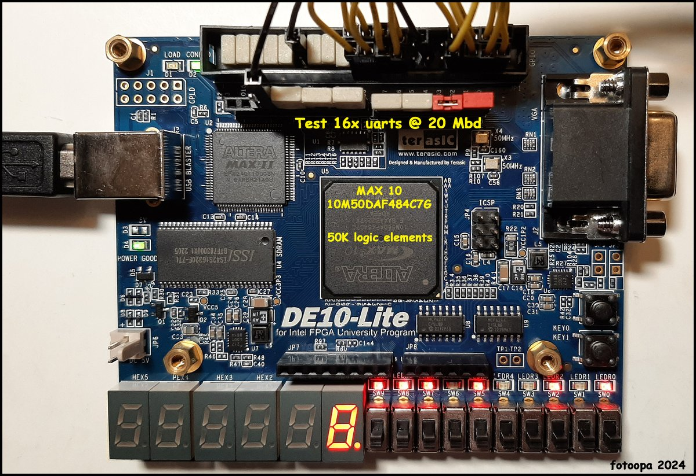

# FPGA Snake Game (Verilog HDL)


-0071C5?logo=intel&logoColor=white)


A snake game on the Terasic DE10-Lite, written entirely in Verilog HDL.



<sub>Target board: Terasic DE10-Lite. Representative photo, not this project's setup (the yellow labels are the photographer's). Photo: [“DE10-Lite-20240112_160112”](https://www.flickr.com/photos/fotoopa_hs/53459607598) by Frans ([fotoopa](https://www.flickr.com/photos/fotoopa_hs)), licensed under [CC BY 2.0](https://creativecommons.org/licenses/by/2.0/); resized.</sub>

## Overview

Pure RTL, no soft processor and no software. Game control, snake storage, collision detection, pseudo-random food placement and display scanning are all in logic: a control FSM, a circular-buffer datapath, clock dividers, a keypad scanner, a multiplexed LED-matrix driver and seven-segment decoding.

## Gameplay

* **Speed**: one move per game-clock tick. The rate rises with the score from 1.11 Hz at score 0 to 10 Hz from score 8 (see [Game speed](#game-speed)). Exactly one of `LEDR[0]`–`LEDR[4]` is lit, showing `score / 2` capped at 4.
* **Score**: one point per food item, up to 99, on HEX5–HEX4.
* **Play time**: MMSS on HEX3–HEX0. The timer runs only in the Play state.
* **Game over**: the snake hits the edge of the 16x8 grid or its own body. Every dot lights up until reset.
* **Snake**: starts 3 segments long, grows by one per food item, up to 32.
* **Food**: positions come from a 16-bit LFSR.
* **No reversing**: a key for the opposite direction is ignored.
* **FSM states**: Idle, Play, Pause, Dead.

## Controls

### Matrix keypad (4x4)

Only four keys are decoded, in a plus shape around row 1, column 1. The keypad is scanned one row at a time (active-low) and the last direction key pressed stays latched.

| Keypad key (row line × column line) | Snake moves toward | Name in `Game_Engine` |
| --- | --- | --- |
| `keypad_row[0]` × `keypad_col[1]` | `matrix_row_sel[0]` side | `KEY_DOWN` |
| `keypad_row[2]` × `keypad_col[1]` | `matrix_row_sel[7]` side | `KEY_UP` |
| `keypad_row[1]` × `keypad_col[0]` | `matrix_col_data[0]` side | `KEY_RIGHT` |
| `keypad_row[1]` × `keypad_col[2]` | `matrix_col_data[15]` side | `KEY_LEFT` |

A lower keypad row or column index moves the snake toward a lower matrix row or column index. The on-screen direction depends on how the keypad and matrix are wired and mounted. For example, with a standard `1 2 3 A` / `4 5 6 B` / `7 8 9 C` / `* 0 # D` keypad (row 0 on top, column 0 on the left) and a matrix with row 0 and column 0 at the top-left, the keys are **2** up, **8** down, **4** left and **6** right.

The `KEY_*` names refer to the internal (x, y) grid. The frame generator draws cell (x, y) at matrix row 7 − y, column 15 − x. The snake starts at matrix row 7, columns 13–15, heading toward column 0.

### Switches

| Function | Switch |
| --- | --- |
| Reset (held while `1`) | SW[0] |
| Pause (while `1`) | SW[1] |

After programming, set SW[0] to `1` and back to `0` to initialize. The game waits in Idle until a direction key is pressed. Pausing stops movement and the timer. SW[9:2] and KEY[1:0] have pin assignments but are unused.

## Design

* **Clock divider**: splits the 50 MHz clock into a 1 kHz scan clock, a game clock (1.11 Hz to 10 Hz) and a 1 Hz timer clock.
* **Keypad scanner**: drives one row low per scan-clock cycle (full scan at 250 Hz), decodes the four direction keys and latches the last one.
* **LFSR**: 16 bits, seed `0xACE1`, feedback from bits 15, 13, 12 and 10, stepped once per food item eaten. Its low bits give the next food cell. If that cell is lit, the food is offset by (+3, +1).
* **Dot matrix**: `Game_Engine` builds a 128-bit frame. `Dot_Matrix_Driver` scans it one row per scan-clock cycle with a one-hot active-low `matrix_row_sel` and 16 `matrix_col_data` bits per row (`1` = dot on). The matrix refreshes at 125 Hz.
* **Seven-segment controller**: splits the score into two decimal digits (÷10 and mod 10) and decodes them with the BCD time digits into active-low segment patterns.
* **Circular buffer**: the body is two 32-entry arrays (`snake_x`, `snake_y`) addressed by 5-bit `head_ptr` and `tail_ptr`. A move writes the new head after `head_ptr` and advances `tail_ptr`. When food is eaten, `tail_ptr` stays and the snake grows. Each move is O(1) instead of shifting every segment. Drawing checks all 32 slots combinationally.
* **Boundary check**: game over if the head is on an edge and the direction points off it. No wrap-around.
* **Self-collision**: game over if the new head position is already lit in the frame. The current tail cell and the food cell are not counted.

### Game speed

`Clock_Divider` toggles the game clock every N cycles of the 50 MHz clock, so one move takes 2N cycles. N starts at 22,500,000 and drops by 5,000,000 per speed level, to a floor of 2,500,000. The speed level is `score / 2` on a 4-bit port.

| Score | Speed level | N (cycles) | Move rate |
| --- | --- | --- | --- |
| 0–1 | 0 | 22,500,000 | 1.11 Hz |
| 2–3 | 1 | 17,500,000 | 1.43 Hz |
| 4–5 | 2 | 12,500,000 | 2.00 Hz |
| 6–7 | 3 | 7,500,000 | 3.33 Hz |
| 8–31 | 4–15 | 2,500,000 (floor) | 10.00 Hz |

The speed level is 4 bits wide (`score / 2` modulo 16), so the sequence repeats every 32 points: score 32 plays at 1.11 Hz again. The LED indicator is computed from the full score and stays on `LEDR[4]` from score 8 upward.

## Code structure

```
FPGA-Game-Engine/
├── Snake_Game_Top.v      // All RTL, one module per concern
├── Snake_Game_Top.qpf    // Quartus project
├── Snake_Game_Top.qsf    // Device, source and pin assignments
├── de10_lite_pins.tcl    // DE10-Lite pin map as a standalone script
├── docs/images/          // Board photo used in this README
└── LICENSE
```

| Module | Role |
| --- | --- |
| `Snake_Game_Top` | Top level: board I/O, wiring, speed-level LED |
| `Clock_Divider` | 1 kHz scan clock, 1 Hz timer clock, score-dependent game clock |
| `Keypad_Scanner` | 4x4 keypad row scan; decodes and latches the four direction keys |
| `Game_Engine` | FSM, circular-buffer snake, collision, LFSR food, play timer, 16x8 frame generation |
| `Dot_Matrix_Driver` | Row-scans the 128-bit frame onto the 16x8 matrix |
| `Seven_Seg_Controller` | Score to decimal digits; seven-segment decoding of score and time |

## Build

Target: MAX 10 `10M50DAF484C7G` (DE10-Lite), Quartus Prime 18.1 Lite Edition.

1. Open `Snake_Game_Top.qpf` in Quartus.
2. Run **Processing → Start Compilation**. Pin assignments are in the `.qsf`; `de10_lite_pins.tcl` holds the same map. Both also assign the external keypad (`keypad_row`, `keypad_col`) and dot matrix (`matrix_row_sel`, `matrix_col_data`) pins.
3. Program the board with `output_files/Snake_Game_Top.sof` via **Tools → Programmer** (USB-Blaster).

Build outputs (`db/`, `incremental_db/`, `output_files/`) are not tracked.

## License

[MIT](LICENSE) © 2026 Adam Fan
